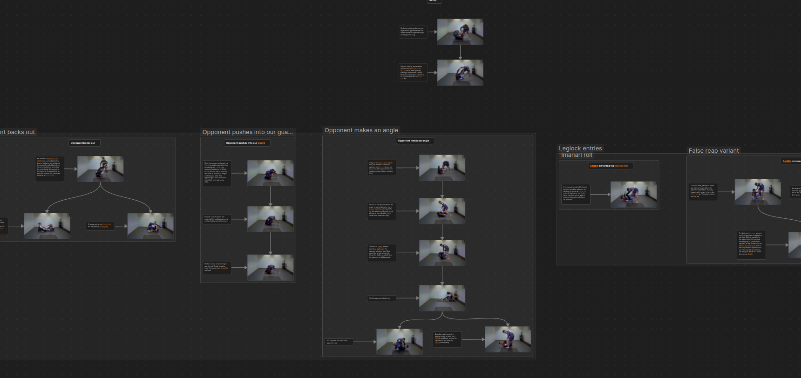
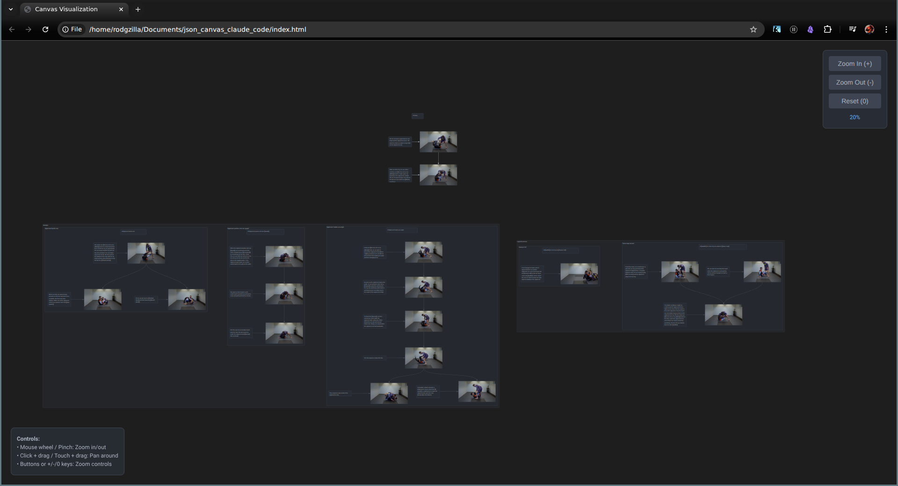

# JSON Canvas to HTML Converter

A lightweight Python tool that converts [JSON Canvas](https://jsoncanvas.org/) files into beautiful, interactive HTML visualizations. Create shareable, self-contained web pages from your visual note graphs without any external dependencies. This project has been created entirely using Claude Code.

## Features

- **Zero Dependencies** - Pure Python 3.7+ with standard library only
- **Self-Contained Output** - All assets embedded as base64 data URLs
- **Interactive Navigation** - Smooth zoom and pan controls for exploring your canvas
- **Mobile-Friendly** - Full touch support with pinch-to-zoom and pan gestures
- **Rich Content Support**
  - Text nodes with basic Markdown formatting
  - Image nodes (PNG, JPG, GIF with auto-play, SVG)
  - Link nodes with clickable URLs
  - Group nodes for organization
  - Connected edges with Bezier curves and optional arrows
- **Dark Theme** - Clean, modern interface inspired by One Dark
- **Offline Ready** - No internet connection required after generation

## Demo

| Obsidian Canvas Editor | Generated HTML Output |
|------------------------|----------------------|
|  |  |

This graph can be accessed [https://rodgzilla.github.io/json_canvas_to_html/](https://rodgzilla.github.io/json_canvas_to_html/).

## Installation

No installation required! Just download the script:

```bash
git clone https://github.com/rodgzilla/json_canvas_claude_code.git
cd json_canvas_claude_code
```

**Requirements:** Python 3.7 or higher

## Usage

### Basic Conversion

```bash
python json_canvas_converter.py input.canvas output.html
```

### With Custom Root Directory

If your canvas references files with relative paths (e.g., `Images/diagram.png`), specify the root directory:

```bash
python json_canvas_converter.py input.canvas output.html --root-dir /path/to/assets
```

### Command-Line Options

```
positional arguments:
  input_file            Path to the input JSON Canvas file (.canvas)
  output_file           Path to the output HTML file

optional arguments:
  -h, --help           Show help message and exit
  -r, --root-dir PATH  Root directory for resolving relative file paths
```

## Examples

### Convert a Simple Canvas

```bash
python json_canvas_converter.py "test canvas.canvas" output.html
```

This will create `output.html` - a standalone file you can:
- Open directly in any web browser
- Share via email or cloud storage
- Host on any web server or GitHub Pages
- View offline without internet access

### Try the Included Examples

```bash
# Convert the included test canvas
python json_canvas_converter.py canva.canvas example.html --root-dir .

# Open the result in your browser
open example.html  # macOS
xdg-open example.html  # Linux
start example.html  # Windows
```

## Interactive Controls

Once your HTML file is generated, you can navigate the canvas using:

### Desktop
- **Zoom:** Mouse wheel, `+`/`-` keys, or zoom buttons
- **Pan:** Click and drag the canvas
- **Reset View:** Press `0` or click the reset button

### Mobile
- **Zoom:** Pinch gesture
- **Pan:** Touch and drag
- **Controls:** Tap the zoom buttons

## How It Works

The converter processes your JSON Canvas file and:

1. **Parses Nodes and Edges** - Reads all visual elements and connections
2. **Resolves File References** - Locates and embeds images/assets
3. **Calculates Layout** - Determines optimal viewport and positioning
4. **Generates HTML** - Creates a single file with embedded JavaScript and CSS
5. **Encodes Assets** - Converts images to base64 data URLs for portability

### Supported Node Types

| Type | Description | Features |
|------|-------------|----------|
| **Text** | Markdown-style text content | Line breaks, basic formatting |
| **File** | Image references | Auto-play GIFs, responsive sizing |
| **Link** | External URLs | Clickable with favicon |
| **Group** | Container with label | Visual organization |

### Edge Features

- Bezier curve connections between nodes
- Configurable connection points (top, right, bottom, left)
- Optional arrow markers
- Custom colors (6 presets + hex support)
- Optional labels

## Technical Details

### Architecture

```
CanvasConverter (Python)
├── JSON parsing and validation
├── File path resolution with fallbacks
├── Base64 asset encoding
├── HTML/CSS/JS template generation
└── Coordinate transformation

Generated HTML
├── Viewport container with pan/zoom
├── SVG layer for edges and curves
├── Positioned nodes layer
└── Interactive control panel
```

### Color Support

Preset colors: `red`, `orange`, `yellow`, `green`, `blue`, `purple`

Custom colors: Any hex code (e.g., `#FF5733`)

### File Path Resolution

The converter tries multiple strategies to locate referenced files:
1. Original path as specified
2. Relative to canvas file location
3. Relative to `--root-dir` (if provided)
4. Basename matching in current directory
5. Recursive search in subdirectories

## Project Structure

```
json_canvas_claude_code/
├── json_canvas_converter.py  # Main converter script
├── IMPLEMENTATION_PLAN.md    # Technical specification
├── canva.canvas              # Example canvas file
├── test canvas.canvas        # Another example
├── index.html                # Example output
├── output.html               # Example output
├── json_canvas.png           # Screenshot (Obsidian)
├── canvas_render.png         # Screenshot (HTML output)
└── subfolder/Images/         # Test assets
```

## About JSON Canvas Format

[JSON Canvas](https://jsoncanvas.org/) is an open file format for infinite canvas data, developed by Obsidian. It's designed to be human-readable and easy to work with programmatically.

This converter implements the JSON Canvas specification v1.0 and supports all standard node and edge types.

## Use Cases

- Share Obsidian canvases with people who don't have Obsidian
- Create visual documentation that can be hosted on any web server
- Generate interactive diagrams for presentations or reports
- Archive canvas snapshots as standalone HTML files
- Embed canvas visualizations in static websites

## Browser Compatibility

Tested and working on:
- Chrome/Edge (90+)
- Firefox (88+)
- Safari (14+)
- Mobile browsers (iOS Safari, Chrome Mobile)

## Contributing

Contributions are welcome! Some ideas for improvements:

- Additional Markdown rendering features
- Custom theme/color scheme options
- Export to other formats (PDF, SVG)
- Advanced edge routing algorithms
- Node search/filter functionality

## License

[Add your license information here]

## Acknowledgments

- JSON Canvas format by [Obsidian](https://obsidian.md/)
- Inspired by the need to share visual knowledge graphs beyond note-taking apps

---

**Made with Python** | No frameworks, no dependencies, just pure simplicity
